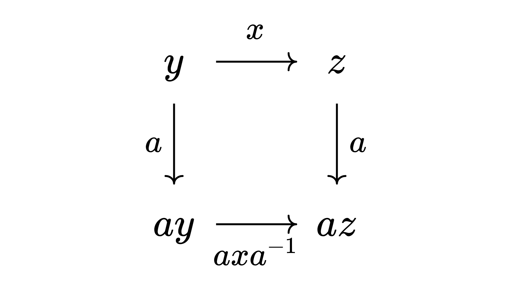

+++
title = "Group Theory Cheatsheet"
published = 2026-08-17
description = ""
image = "cover.jpg"
tags = ["Algebra"]
category = ""
draft = false
lang = ""
+++

# Group Theory Cheatsheet

随便写的一些笔记，或许能帮助建立直觉，没有学习的价值。

## 群

### 集合

一个简单的集合 $S$ 没有结构，我们无法区分两个一样多（ *等势* ）的集合。

### 二元运算

如果在集合 $S$ 上添加一个二元运算 $f : S \to S \to S$ , 现在 $(S, f)$ 就有了一些结构。

这个二元运算经常叫做「乘法」，而 $(S, f)$ 在没有歧义的时候经常直接缩写成 $S$ .

如果 $S$ 是一个 $n$ 个元素的有限集，我们可以画一个 $n \times n$ 的乘法表来记录 $f$ . 这称为 **Cayley表** 。

> $(\mathrm{boolean}, \land)$
> 
> | $\land$ | $0$ | $1$ |
> | ------- | --- | --- |
> | $0$     | $0$ | $0$ |
> | $1$     | $0$ | $1$ |

### 结合律

如果运算满足结合律，$(S, f)$ 定义成一个 **半群** 。

传统的抽象代数一般只研究有结合律的结构。

### 幺元

有单位元的半群称为 **幺半群** 。可以证明单位元是唯一的（$1_a1_b = 1_a$ , $1_a1_b=1_b$ ）.

### 群

所有元素都有 *逆元* 的幺半群是 **群** 。一个元素 $a$ 有逆，也意味着 $f(a, -)$ 和 $f(-, a)$ 都是可逆的。一个很自然的推论是消去律。也就是说，和实数乘法不同，群的乘法没有一个类似 $0$ 的元素。我们也可以直观认为 $f(a, -)$ 和 $f(-, a)$ 不丢失任何信息。

## 群作用

函数的复合已经有结合律。如果我们可以把一些元素看成函数的话，那就可以把复合作为二元运算来建立群了。很多群本来就都是函数（比如对称群）。但是，也有一些群的元素看上去不像函数（比如循环群 $\Z_n$ , 虽然你也可以说它是步长 $\frac{2\pi}{n}$ 的旋转）。

### Cayley 定理

> 所有群都同构于某个对称群的子群。

这个结论甚至对无限群也成立！其实很好理解，对于 $g : G$ , $x \mapsto gx : G \to G$ 就是一个置换。

有了 Cayley 定理的辅助，我们确实可以真的将所有群理解成函数作为元素，复合作为运算。需要注意的是，这样有时候或许更符合直觉，但也可能让心智负担加重。把群当成一种「数」还是一些函数，视角可以按需切换。

### G-Set

回到群作用的视角，Cayley 定理说的是我们可以把 $G$ 作用到 $G$ 上（把 $G$ 对应到 $G \to G$ 的函数）。但其实，我们不一定非要把 $G$ 作用在它自己身上，而可以是随便一个集合 $S$ . 因为我们希望群运算就是函数复合，所以需要有这样的约束：

> 结合律 $\forall g, h \in G$ , $x \in S$ , $(gh)x = g(hx)$ .

注意等式左边的两个乘法，一个是 $G$ 中的乘法，一个是 $G$ 对 $S$ 的作用；右边两个都是作用。此时 $S$ 被叫做一个 **$G$ -Set** .

## 轨道-稳定子定理

在一个 $G$ -Set $S$ 中，元素 $x$ 的 **轨道** 是它所有「能去的地方」：

$$
\operatorname{orb}_G(x) = \left\{ gx \mid g \in G \right\}
$$

显然「同轨道」是一种等价关系（因为群元都有逆）。**稳定子** 是所有 $G$ 中保持 $x$ 不动的元素（不要与 $S$ 中的「不动点」混淆）：

$$
\operatorname{stab}_G(x) = \left\{ g \in G \mid gx = x \right\}
$$

任意一个元素 $x$ 都给出一个 $G$ 在两个方向（「使 $x$ 运动的方向」和「垂直于 $x$ 的方向」）上的分解，这就是 **轨道-稳定子定理** ：

> $\left| G \right| = \left | \operatorname{orb}_G(x) \right| \cdot\left | \operatorname{stab}_G(x) \right|$ .

和之前的 Cayley 定理一样，如果你把基数代入到话，它对无限群也一样成立：

$$
\left| \operatorname{orb}_G(x) \right|
= \left| G : \operatorname{stab}_G(x) \right|
$$

这个定理非常有用！通过选取不同的 $S$ 和作用方式，它可以导出许多其他的定理。

### 轨道分解

既然我们提到过「同轨道」可以是等价关系，我们自然可以把一个 $G$ -Set 分成若干个轨道的不交并。这是一个很有用的技巧。

## 子群

定义上说，*子群* 是在原来的群的运算下依然能构成群的子集。我们也可以认为子群是用「先取一些元素，把它们的乘积和逆也加进来，重复直到没有新的元素」这个程序的产物。

### 陪集

如果用一点线性代数的类比，一个子群看成一个「方向」，在这个方向上的移动永远在这个方向上，而不在子群里的元素则包含了其它方向。陪集就可以看成一个子群被平移了一段距离。所有这些陪集把群划分成很多个「平行」的部分。

或者，对于子群 $H \le G$ , 也可以定义一个等价关系 $a \sim_H b := \exist h \in H$ s.t. $a = bh$ （这是左陪集，右同）。这样的话陪集就是 $G / \sim_H$ 下的等价类。

所有陪集的大小相等。

## Lagrange 定理

> 子群的阶整除群的阶。

群被划分成若干个陪集，每个陪集都和子群一样大。

## 第一同构定理

> 同态 $\phi: G \to H$ , $G / \ker \phi \cong H$ .

从 $\ker \phi$ 的所有陪集， $g \ker \phi \mapsto \phi(g)$ 是同构。

## 交换

满足交换律的群称为 **阿贝尔群** 。

### 中心

群 $G$ 中和所有其他元素交换的元素 $\operatorname Z(G)$ .

> $G$ 是交换群，当且仅当 $G/\operatorname Z(G)$ 是循环群。

### 中心化子

群 $G$ 中所有和元素 $a$ 交换的元素 $\operatorname C_G(a)$ , 或者简写成 $\operatorname C(a)$ .

显然 $\operatorname Z(G) \le \operatorname C_G(a)$ .

## 有限交换群基本定理（分类）

> 所有有限交换群都同构于某个唯一确定的乘积 $\prod_i \Z_{p_i^{n_i}}$ , 其中每一项都是阶为素数的幂的循环群。

TODO

## 共轭

群 $G$ 中的共轭关系 $a \sim b := \exist g : G$ s.t. $b=gag^{-1}$ 看上去莫名奇妙，所以我们多作一些解释。

我们知道对称群 $\mathrm S_3 = \left\{ (1), (12), (13), (23), (123), (132) \right\}$ 有三个共轭类：

- $\operatorname{cl} (1) = \left\{ (1) \right\}$ ;

- $\operatorname{cl}(12) = \left\{ (12), (13), (23) \right\}$ ; 和

- $\operatorname{cl}(123) = \left\{ (123), (132) \right\}$ .

但这建立在「我们给顶点起了名字」的基础上。如果抹掉元素上的数字标签，我们就只知道 $\mathrm S_3$ 里有一个恒等映射，三个两两换位操作，和两个轮换操作。不严谨[^conj-loosely]地说，共轭类中的元素在抹掉名字后，凭群当中的运算关系无法区分。

如何描述这种对称性呢？我们知道群当中的信息都来自乘法。比如我们想研究元素 $x$ , 我们可以有很多关于 $x$ 的乘法关系 $z_1 = xy_1$ , $z_2 = y_2x$ , ... 这里为了方便我们先举左乘 $z=xy$ 为例。

我们「站在」群里的另一个元素 $a$ 上去观察整个群（我们把群平移一个 $a$ , 和坐标系变换也有点像）。现在我们看到的 $z'$ 其实是原来的 $az$ , $y'$ 是原来的 $ay$ . 那现在从 $z'$ 到 $y'$ 的变换就是一个新的左乘 $\mathrm L_{x'}$ . 简单的计算告诉我们 $x' = axa^{-1}$ .

另外，由于取共轭也是自同构 ( $\operatorname{Inn} G \le \operatorname{Aut} G$ ), 所有用乘法和取逆写成的关系式 $f(x_1, x_2, \cdots, x_n) = 1$ , 取共轭之后 $f(ax_1a^{-1}, ax_2a^{-1}, \cdots, ax_na^{-1}) = 1$ 依然成立。

如果把自同构群看成置换群的子群的话，我们还可以得到

$$
\operatorname{cl}(x) = \operatorname{orb}_{\operatorname{Inn}G}(x)
\subseteq \operatorname{orb}_{\operatorname{Aut}G}(x) 
$$

### 计数

- $\left| \operatorname{cl}(x) \right| = \left| G : \operatorname C(x)\right|$ . 这就相当于是把 $G$ 通过 $g \mapsto x \mapsto gxg^{-1}$ 作用到自己身上时的轨道-稳定子定理。

- $|G| = \sum_{[x] \in G/\mathrm{conj} }|G:\operatorname C(x)|$ , 作为上一条的推论。

## Sylow 第一定理

> 对于群 $G$ 和素数 $p$ , 如果 $p^k \mid \left| G \right|$ , 那么 $G$ 有一个阶为 $p^k$ 的子群。

注意 $G$ 不一定要有阶为 $p^k$ 的元素！最简单的反例是 ${\Z_p}^n$ , 这里所有元素的阶都不大于 $p$ .

虽然 Sylow 系列的定理都很有用，但它们一般的证明都不好看，所以我们多用一些篇幅，先从一个更基本的引理开始。

### Cauchy 定理

> 如果 $p \mid \left| G \right|$ , 那么 $G$ 有一个阶为 $p$ 的元素。

当然，这也能作为 Sylow I 的推论，但考虑到我们的证明确实用了它。

我们希望找一个 $g$ 使得 $g^p = 1$ . 这里有一点技巧，所以我们先考虑所有乘起来是 $1$ 的 $p$ 元组。显然你可以随便选前 $p - 1$ 个元素来唯一确定最后一个元素，所以一共有 $\left| G \right|^{p-1}$ 个这样的元组。

现在我们取一个 $\mathrm S_p$ 的子群 $P = \langle (123 \cdots p) \rangle$ 应用到这些 $p$ 元组上。我们还知道 $P \cong \Z_p$ , 这样的话轨道-稳定子定理就告诉我们每个轨道的大小要么是 $1$ , 要么是 $p$ . 大小是 $1$ 的轨道至少有一个（至少有一个只包含 $\mathbf 1_p$ 的），所以至少有 $p$ 个（否则总数不对），这样就有一个不是单位元的 $(123\cdots p)$ 的不动点，也就是所有分量相同，这就有 ${x_0}^p = 1$ .

### 证明

显然我们有很多 $p$ -子群（存在性由 Cauchy 定理保证）。假设 $p^t$ 是当前最大的，而 $t < k$ , 我们给出一个方法，找到一个更大的 $p$ -子群。

我们先把这个子群记作 $P$ . $P$ 是 $\operatorname{N}(P)$ 的子群。如果 $p^{t + 1}$ 整除 $\left| \operatorname{N}(P) \right|$ 的话，Cauchy 定理告诉我们 $\operatorname{N}(P) / P$ 当中有一个 $p$ 阶元素 $xP$ . 显然 $x$ 在 $G$ 中同样有 $p$ 阶，又不在 $P$ 当中，所以 $\langle P, x \rangle$ （原谅这里的野蛮记法）是一个比 $P$ 还大的 $p$ -子群（因为 $P$ 在 $\langle P, x \rangle$ 中是正规的！一共有 $x^0P$ 到 $x^{p-1}P$ 的 $p$ 个陪集），它的阶就是 $p^{t+1}$ .

我们完成了 $p^{t+1} \mid \left| \operatorname{N}(P) \right|$ 的情况，剩下来 $\left| \operatorname{N}(P) \right| = p^t c$ , $p \nmid c$ 的情况。 但这样的话 $t < k$ 就告诉我们 $p \mid \left| G : \operatorname{N}(P) \right|$ , 而 $\left| G : \operatorname{N}(P) \right|$ 这个数恰好就是 $P$ 的共轭子群的个数（只有 $\operatorname{N}(P)$ 中的元素做共轭会固定不动）！我们把这些共轭子群收集成一个集合

$$
S = \left\{ gPg^{-1} \mid g \in G \right\}
$$

现在把 $P$ 共轭作用到 $S$ 上。因为轨道-稳定子定理，每个轨道的大小都要整除 $\left| P \right|$ , 所以要么是 $1$ , 要么是 $p$ 的倍数。这其中大小为 $1$ 的轨道至少有一个包含 $P$ 本身的。

- 如果还有一个子群 $Q \in S$ 的轨道大小也是 $1$ , 我们知道 $P \le \operatorname{N}(Q)$ , 所以 $PQ$ 也是一个 $p$ -子群（因为 $\left| PQ \right| \mid \left| P \right| \cdot \left| Q \right|$ ）, 而它要比 $P$ 大！

- 如果没有其他的 $Q$ 了，但是 $p \mid \left| S \right|$ , 计数一下所有轨道的大小就会造成矛盾。

[^conj-loosely]: 如果按照这个说法，$\Z_3$ 中 $1$ 和 $2$ 看上去也共轭
