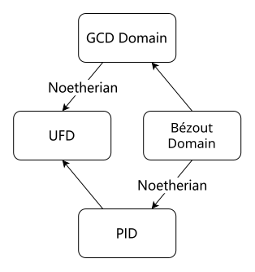

+++
title = "Ring and Field Theory Cheatsheet"
published = 2026-09-12
description = ""
image = ""
tags = []
category = ""
draft = true
lang = ""
+++

# Ring and Field Theory Cheatsheet

## 环

严格来说，环的定义在以下两种之间因人而异，并没有一个统一的共识。我们称 $(R, +: R\times R \to R, \times: R \times R \to R)$ 是一个 **环** ，当且仅当：

1. $(R, +)$ 是交换群，且
   
   1. （要求乘法单位元的版本）$(R, \times)$ 是幺半群；
   
   2. （不要求乘法单位元的版本）$(R, \times)$ 是半群；且

2. 满足乘法分配律 $a, b, c: R$ , $a(b + c) = ab + ac$ , $(a+b)c = ac + bc$ .

我们先默认不要求环必须有乘法单位元，并把 1.1 中的「环」称为有单位环 / unital ring（反过来的话就可以把 1.2 的「环」称为非单位环 / nonunital ring）.

一般来说，直观上把一个环理解为 $\Z$ , $\mathbb Q$ , $\R$ 一类的某种「数」就可以。初等环论环论基本上就是在研究和 $\Z$ 类似的对象，看有什么 $\Z$ 上的性质可以推广到一般的环上。

### 域

如果我们在环的基础上，额外要求 $(R - \left\{ 0 \right\}, \times)$ 要是一个群而非（幺）半群，此时 $(R, +, \times)$ 就成为一个 **域** 。

注意到我们可以推出加法单位元 $0$ 乘所有元素都是 $0$ , 所以如果要成为群则必须去掉它。

## 向量空间

我们之前说到可以把一个环看成是某种特殊的数。这样的话，我们也可以将这种数作为某些向量空间的「标量」使用——标准地说，向量空间的标量需要是一个域。

一个域 $F$ 上的向量空间 $V$ 首先需要装备向量加法——也就是说 $V$ 要是交换群。此外，我们还需要一个数乘 $\bullet : F \to V \to V$ 来把 $F$ 作用到 $V$ 上。

> 交换群 $V$ 是一个域 $F$ 上的 **向量空间** ，当且仅当：
> 
> 1. $\mathbf v, \mathbf w : V$ , $a : F$ , $a(\mathbf v + \mathbf w) = a\mathbf v + a \mathbf w$（对向量加法的分配律）；
> 2. $\mathbf v : V$ , $a, b : F$ , $(a + b)\mathbf v = a\mathbf v + b\mathbf v$（对标量加法的分配律）；
> 3. $\mathbf v : V$, $a, b : F$ , $(ab)\mathbf v = a(b \mathbf v)$ ; 且
> 4. $1\mathbf v = \mathbf v$ $\forall \mathbf v \in V$ .

其中 3, 4 两条和群作用的要求很像。

### 模块

如果我们放松对向量空间的标量的要求，从域到普通的环 $R$ , 此时的「向量空间」就称作一个 **$R$ -模块** 。

如果这个标量是 $\Z$ 的话，最自然的定义数乘的方式就是 $(n, \mathbf v) \mapsto \sum_{i=1}^n \mathbf v$ . 我们注意到这个定义对 $V$ 本身没有做任何要求！也就是说，对所有的交换群都适用。

> 所有交换群都是 $\Z$ -模块。

## 多项式环

我们不仅可以拿环作为标量，还可以作为多项式的系数——多项式的加减乘运算只用到了系数的环运算，而且这样子的多项式自己也可以当成环。记号 $R[x]$ 指以环 $R$ 为系数 $x$ 为变量的 **多项式环**（这里 $x$ 单纯只是一个记号，有时我们也会直接写一个不在 $R$ 里的元素比如 $\Z[\frac{1}{2}]$ ）。

留意一下多项式的项数是 ***有限*** 的，不然的话你会得到 $\Z[\frac{1}{2}] = \R$ .

在系数 $R$ 是域的情况下，可以做多项式带余除法，同时会有代数基本定理的推论（ $n$ 次多项式不超过 $n$ 个根）。

## 理想

类比一下子群，如果一个环的子集也是环，就称之为子环。不要求环一定有乘法单位元的好处之一就是让 $n\Z$ 是 $\Z$ 的子环。

有一些子环可以「吸收」环里的其他元素。这和群论中的正规子群比较类似——后者是在任意共轭下不变，而前者是在任意乘法下不变。

> 一个 **理想** $I$ 是环 $R$ 的一个子环，满足 $rI \subseteq I$, $Ir \subseteq I \space$ $\forall r \in R$ .
> 
> 在非交换环中，满足 $rI \subseteq I$ 部分的称为 **左理想** ，满足 $Ir \subseteq I$ 的称为 **右理想** 。

一个很好的理解方式是将理想看作「具有某个因子的所有元素」，这里用到了一点 $\Z$ 上的类比：如果乘法中的一侧带有某个因子，则乘积中也必然带这个因子。比如说，$2\Z$ 就是 $\Z$ 上的一个理想。

需要注意的是，虽然我们可以直观上这样理解一个理想，但所谓的「某个因子」并 ***不*** 一定要在环中真的存在（如果要求所有的理想对应的「某个因子」都要存在，环必须是 [PID](#主理想整环-pid) ）. ***确实*** 包含 ***一个*** 指定的因子 $a$ 的理想 $\langle a \rangle$ 称为 **主理想** 。

### 素理想

我们还是用「具有某个因子」来看理想。整数中，你不能用两个不含某个素因子的数乘出来这个素数——如果一个乘积含有某个素因子，那要么左侧，要么右侧，至少一边含有这个素因子。如果某个理想对应的因子——再次强调这只是便于理解，可以不存在——是个「素数」的话，这就是一个素理想。

> $R$ 的一个理想 $I$ 是 **素理想** ，当且仅当 $ab \in I \implies a \in I \lor b \in I$ $\forall a, b \in R$ .

#### 交换环中的素元

非 $0$ 的元素 $p : R$ 是一个 **素元** 当且仅当 $p \mid ab \implies p \mid a \lor p \mid b$ $\forall a, b \in R$ .

显而易见地 $\Z$ 上的素元就是素数（包括负素数）。注意到我们用了和素理想的定义想一致的 [Euclid 引理](https://en.wikipedia.org/wiki/Euclid%27s_lemma) ，而非整数上通常会用的素因子分解来定义素元。这实际上是一个更强的条件（见 [不可约元](#不可约元) ）。

素元生成素理想。

### 最大理想

如果没有非平凡地包含某个理想的理想，或者严谨地说，$R$ 中的理想 $I \subseteq A \implies A = I \lor A = R$ , 那 $I$ 就称为一个 **最大理想** 。

在 $\Z$ 中，除了 $\langle 0 \rangle$ 以外的所有素理想都是最大理想（另外注意 $\langle 0 \rangle$ 是素理想，虽然 $0$ 不是素数）。

一个不一定恰当的理解是，环里面可能有很多的「方向」。对于最大理想来说，只要再多任意一个方向，就会直接生成整个环；而素理想则只是在部分几个方向上。比如，对于域 $F$ , $F[x, y]$ 中 $\langle x \rangle$ 就是素理想，但最大理想 $\langle x, y \rangle \supseteq \langle x \rangle$ . 或者，对 $\Z$ 来说，只要你加入一个与现在的理想里面互素的元素，就会生成整个 $\Z$ .

> **定理** 有单位交换环 $R$ 中，$I \subseteq R$ 是最大理想当且仅当 $R / I$ 是域。

直接展开定义，利用 $I$ 最大 $\iff R/I$ 只有 $\langle 0 \rangle$ 和 $R/I$ 两个理想的事实。

### Noetherian 环

所有（左 / 右）理想都有限生成的环称为（左 / 右）**Noetherian 环** 。

Noetherian 环好处之一是，因为生成元只有有限个，在处理时经常可以数学归纳法。

## 整环

没有 *零因子* 的有单位交换环叫做 **整环** 。

这可能不是一个好的命名，「没有零因子」和「整数」的关系看上去并不大。不过，有关的一点是整环可以通过加入分数变成域，就像 $\Z$ 到 $\mathbb Q$ . 整环 $D$ 的 **分数域** 记作 $\operatorname{Frac}(D)$ . 

> **定理** 有限整环是域。

你不能在 $\langle a \rangle$ 中无限乘下去而不回到原地。

显然，在一个交换环中模掉素理想会得到整环，因为我们当成 $0$ 的是素理想，所以乘积是 $0$ 的两侧必然有 $0$ , 于是就没有零因子。

> 有单位交换环 $R$ 中，$I \subseteq R$ 是素理想当且仅当 $R/I$ 是整环。

## 唯一分解整环 (UFD)

在 $\Z$ 上可以通过分解素因子把整数写成更小的素数的乘积。在整环的多项式环上可以因式分解，把多项式写成次数更低的多项式的乘积（如果没有整环的条件，分解出来的次数可能比原来还大！）。看上去，我们在整环中，始终可以尝试把一个元素分解成很多素元的乘积。

### 不可约元

我们希望所有的「合数」都能分解成一系列素元的乘积，但尝试一下就会发现做不到——在整数上，不能分解的元素按定义就是素数。而由于我们采用了 Euclid 引理作为素元的定义，不能分解的元素就未必是素元了。

当然，想要分解一个整环中的元素 $x$ , 我们自然可以随便取一个有逆的元素（如果存在的话，这并不是一件稀奇的事）$a$ 然后宣布 $x = (ax) (a^{-1})$ 就是我们找到的分解。为了排除这种平凡的情况，避免在存在可逆元时所有的元素都可以分解，我们人为规定一个成功的分解必须包含一个没有逆的元素。

> 整环 $D$ 的一个元素 $x$ 称为 **不可约元** ，当且仅当 $x = ab \implies$ $a$ 有逆或 $b$ 有逆。

### 不唯一的分解

现在我们可以把不可约元，而非素元，当成我们的「素数」来实施分解。这可以保证每个元素都存在分解。但是，回想一下为了证明整数的素因子分解是唯一的，我们会假设两个不一样的分解，然后用 Euclid 引理指出素数整除素数，来得到相等的结果。这个证明在现在也不适用了。

因此，利用不可约元的分解 ***不唯一*** 。一个更具体的例子是在 $\Z[5\mathrm i]$ 中，$9 = 3 \times 3 = (2 + 5\mathrm i)(2-5\mathrm i)$ . 有些时候，这不成问题。但我们如果一定想要一个唯一的分解，则规定这样的环称为 **唯一分解整环 (UFD)** 。

> **定理** UFD 中不可约元是素元。

通过考虑两边的分解，容易证明不可约元 $p \mid ab \land p \nmid a \land p \nmid b$ 实现不了。

### 最大公因数整环

在整数上，我们有最大公因数的定义：

$$
\gcd(a, b) \mid a \land \gcd(a, b) \mid b \land (c \mid a \land c \mid b \implies c \mid \gcd(a, b) \space \forall c)
$$

并且还能用很多方式来求出最大公因数，比如素因子分解或者辗转相除。把两个数素因子分解，然后取每个素因子最低次的算法在 UFD 上依然可以使用。但 UFD 不只保证了最大公因数的 ***存在*** ，还给出了一个 ***计算*** 最大公因数的方法。没有人规定最大公因数一定要这样计算（如果你不是直觉主义者，甚至可以辩称提供某个对象的存在性证明，***不一定*** 需要给出它的明确构造）。因此 UFD 是一个比最大公因数公理要 ***强*** 的性质。

> **定义** 整环 $D$ 中，如果 $\forall a, b \in D$ 都存在 $d \in D$ 满足最大公因数公理，则 $D$ 称为 **最大公因数整环** 。

> UFD 是 GCD 整环。

需要注意，我们并没有指定 $\gcd(a, b)$ 的 ***唯一性*** 。但我们由定义可以得出任意两个最大公因数都互相整除，所以在相伴意义下唯一。

可以证明 $\operatorname{lcm}(a, b) := \frac{ab}{\gcd(a, b)}$ 是一个满足要求的最小公倍数。

$$
a \mid c \land b \mid c \implies \operatorname{lcm}(a, b) \mid c \space \forall c
$$

对于整数 $n$ ， 我们有这样的性质：

- $a \mid n \lor b \mid n \implies \gcd(a, b) \mid n$（注意逆命题 ***不*** 成立！比如 $2 \mid 10$ 不代表 $4 \mid 10 \lor 6 \mid 10$ ）；

- $a \mid n \land b \mid n \iff \operatorname{lcm}(a, b) \mid n$ .

回想我们关于理想的 [比喻](#理想) ，这两个性质也可以用主理想的语言来写：

- $\langle a , b \rangle \subseteq \langle \gcd(a, b) \rangle$ ;

- $\langle a \rangle \cap \langle b \rangle = \langle \operatorname{lcm}(a, b) \rangle$ .

同时注意一下 $\langle a \rangle \cap \langle b \rangle$ 本身就始终是理想，而 $\langle a \rangle \cup \langle b \rangle$ 则不一定，需要 $\langle a, b \rangle = \langle \langle a \rangle \cup \langle b \rangle \rangle$ 才行。

最大公因数的存在允许了推广版本的 Euclid 引理 ( $n \mid ab \land \gcd(n, a) = 1 \implies n \mid b$ ). 由此可以证明 GCD 整环中的不可约元就是素元。

#### 有限 + 唯一

Noetherian 条件可以保证不可约分解存在且有限，GCD 整环可以保证不可约元是素元，进而保证不可约分解是唯一的（在相伴意义下）。

> Noetherian 的 GCD 整环是 UFD.

## 主理想整环 (PID)

### Bézout 整环

$\Z$ 上，任意两个元素 $a$ 和 $b$ 的线性组合 $\left\{ ax+by \mid x, y \in \Z \right\}$ [恰好就是最大公因数 $\gcd(a, b)$ 的倍数](https://zh.wikipedia.org/wiki/%E8%B2%9D%E7%A5%96%E7%AD%89%E5%BC%8F) 。书接上回，就是说虽然 $\gcd(a, b) \mid n \ne a \mid n \lor b \mid n$ , 但理想 $\langle a, b \rangle = \langle \gcd(a, b) \rangle$ . 可并不是所有环中的理想都能用一个元素表示（比如 $\langle 2, x \rangle \subseteq \Z[x]$ ）, 更多的情况下 $\langle a, b \rangle \subset \langle \gcd(a, b) \rangle$ .

我们发现这里取等的条件是 $\gcd(a, b) \in \langle a, b \rangle$ , 考虑 $\langle a, b \rangle$ 定义为 $a$ 和 $b$ 的线性组合，就是 Bézout 等式 $\gcd(a, b) = ax+by$ .

> **Bézout 整环** $D$ 等价定义为以下两者之一：
> 
> - $\exist a, b \in D$ s.t. $\gcd(a, b) = ax + by$ $\forall a, b \in D$ ;
> 
> - $\exist d \in D$ s.t. $\langle a, b \rangle = \langle d \rangle$ $\forall a, b, \in D$ .

Bézout 整环给我们带来一个很好的工具：我们可以把任意两个元素生成的理想压缩为一个主理想。利用数学归纳法，我们发现，所有有限生成的理想都可以被压缩为一个主理想！

> **定义** 所有理想都是主理想的整环称为 **主理想整环 (PID)** .

> PID 等价于 Noetherian Bézout 整环。

### 示意图

