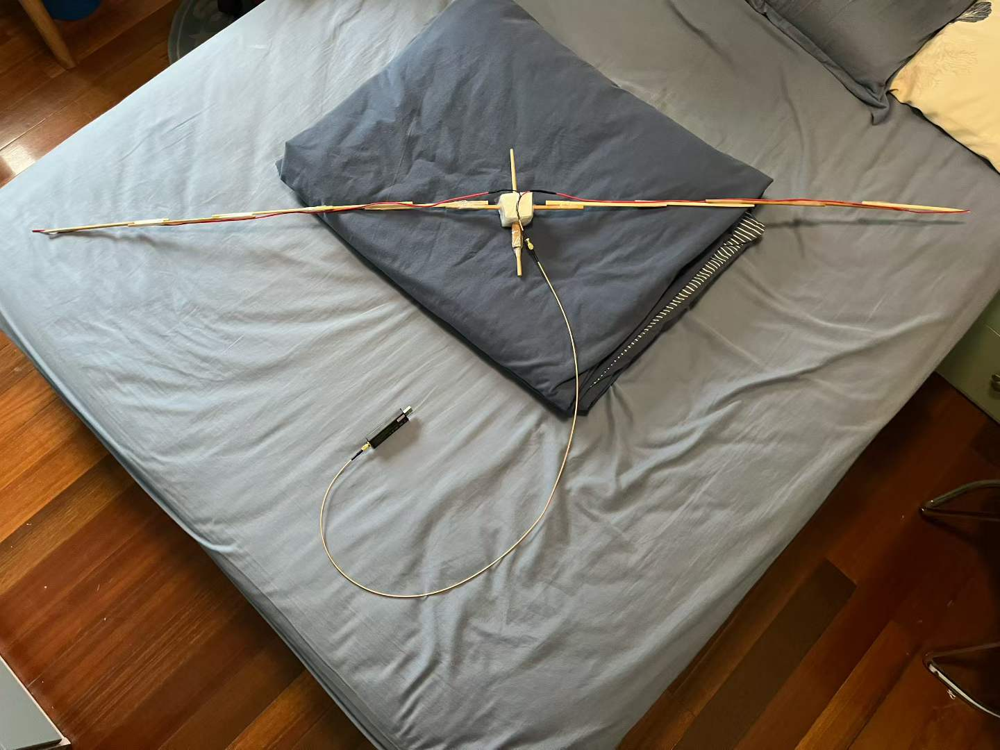

+++
title = "手搓半波偶极子天线"
published = 2026-08-15
description = ""
image = "cover.png"
tags = ["Radio"]
category = ""
draft = false
lang = ""
+++

# 手搓半波偶极子天线

作为业余无线电新手，我们做一个极简版（没有巴伦，制作无需电烙铁）的半波偶极子天线，收 FM 广播。在没有考虑过精简成本的情况下，大概需要 CNY 20.

## 材料与工具

- 电线（单芯）, 按照需要的频率计算长度（ $c = \lambda f$ , 我们至少要 $\frac \lambda 2$ 长）
  
  - 可以尝试回收各种废弃线材

- SMA 同轴电缆

- SMA 转 2pin 接头一个

- 一些一次性筷子

- 泡沫塑料一块（起到角件的作用，以 PET 瓶或卡纸盒替代都可以）

- 卷尺

- 透明胶带，电工胶布

- 剪刀 / 裁纸刀

## 程序

1. 量出两截 $\frac \lambda 4$ 长的电线，接线在 SMA 转 2pin 接头上；
   
   - 记得多留 ~10cm 的冗余。

2. 拿两根一次性筷子，十字形插在泡沫塑料上；
   
   - 注意两根木棍的位置不要互相干涉；
   
   - 泡沫塑料掉碎屑的话，考虑用胶带裹起来。

3. 取一根轴作为两臂，用胶带连接一次性筷子，对称延长至 $\frac \lambda 2$ ;

4. 取出之前接好的电线，把 SMA 接头固定在泡沫上，两根线沿两臂延伸固定；

5. 因为制造公差问题，这时两侧电线的长度可能有差异，都剪到离馈电点 $\frac \lambda 4$ 长；

6. 插上同轴线；

7. 由于没有巴伦，可以把同轴线在筷子上绕几圈，聊胜于无。

共需要大概 1h 时间。

---

这是我的成品，尺寸是上海广播电台的 93.4MHz $\frac{1}{2} \frac{299792458\mathrm{m/s}}{93.4 \mathrm{MHz}} = 1.60 \mathrm{m}$ .
