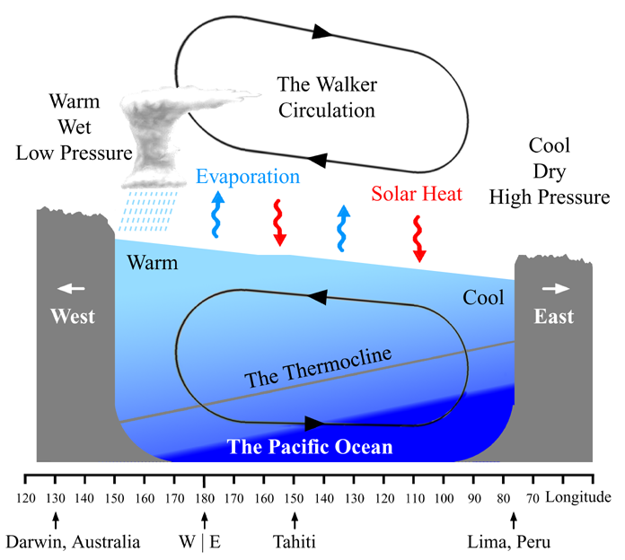
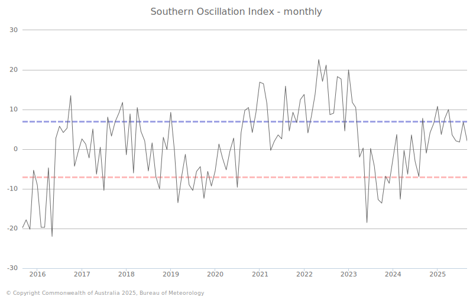

+++
title = '厄尔尼诺-南方涛动实在是太简单了'
published = 2025-09-16
description = ''
image = 'cover.jpg'
tags = ['Earth', 'AP ES']
category = 'XITE'
draft = false
lang = ''
+++

# 厄尔尼诺-南方涛动实在是太简单了

*本质上是南方涛动指数的周期性变化* 

## 南美洲暴雨

人类的气象观测发现，在一部分年份，赤道地区太平洋东岸（主要是南美洲）地区气候显著暖湿，引发洪水、传染病等灾害；相反地，在太平洋西岸（主要是印尼、澳大利亚等地区），气候显著干冷，导致干旱或森林大火，西北太平洋台风等级增强。秘鲁人将其称为 **厄尔尼诺 (El Niño)** , 因南美多在圣诞节前后感受，以西班牙语 *El Niño de Navidad* （「新生的耶稣」）名。

## 从 Walker 环流开始

在太平洋赤道地区，信风（东风）会推动海水自东向西流动，形成 [南](https://zh.wikipedia.org/wiki/%E5%8D%97%E8%B5%A4%E9%81%93%E6%B4%8B%E6%B5%81) 、[北](https://zh.wikipedia.org/wiki/%E5%8C%97%E8%B5%A4%E9%81%93%E6%9A%96%E6%B5%81) 赤道暖流（注意赤道无风区有补偿的 [赤道逆流](https://zh.wikipedia.org/wiki/%E8%B5%A4%E9%81%93%E9%80%86%E6%B5%81) ）。暖流驱使表层温暖海水在西岸堆积，深层冷水在东岸 [上升](https://zh.wikipedia.org/wiki/%E4%B8%8A%E5%8D%87%E6%B5%81) 形成 [秘鲁](https://zh.wikipedia.org/wiki/%E7%A7%98%E9%AD%AF%E6%B6%BC%E6%B5%81) 和 [加利福尼亚](https://zh.wikipedia.org/wiki/%E5%8A%A0%E5%88%A9%E7%A6%8F%E5%B0%BC%E4%BA%9E%E6%B4%8B%E6%B5%81) 寒流。这使得太平洋整体呈现出西热东冷的热量分布。

这个过程是正反馈的。由于西太平洋较东太平洋温暖，低压热空气在西太平洋上升，驱动热力环流加强东风，从而将更多暖水向西搬运。这个环流命名为 **Walker 环流** 。

## 南方涛动指数

**南方涛动指数 (Southern Oscillation Index, SOI)** 是反映 [大溪地](https://zh.wikipedia.org/wiki/%E5%A4%A7%E6%BA%AA%E5%9C%B0%E5%B3%B6)（法属波利尼西亚，东太平洋）与 [达尔文](https://zh.wikipedia.org/wiki/%E8%BE%BE%E5%B0%94%E6%96%87_(%E6%BE%B3%E5%A4%A7%E5%88%A9%E4%BA%9A))（澳大利亚，西太平洋）气压差值的函数。

[澳大利亚气象局](https://www.bom.gov.au/climate/enso/soi/) 具体定义为，若某月大溪地平均气压 $P_\mathrm{Tahiti}$ , 达尔文平均气压 $P_\mathrm{Darwin}$ , 令 $\Delta$ 和 $\sigma$ 分别为 1951-2000 年当月的气压差平均值和标准差，则标准化的南方涛动指数为

$$
\mathrm{SOI}=10 \cdot \frac{P_\mathrm{Tahiti} - P_\mathrm{Darwin} - \Delta}{\sigma}
$$

展开定义，SOI 标志 Walker 环流的强度。SOI 越大时，东太平洋气压高出西太平洋更多，相应东风更强，反之亦然。

## 周期性变化

在现实中，Walker 环流并非恒常处于平衡，而正反馈特点与气象系统的混沌性使得它对多种扰动较为敏感。这在气象记录上显示出近似于以 4 年为周期的反复振动。振动的具体机制或许是因为海水不允许凭空出现或消失，在正反馈循环进行到一定程度时会发生过冲，触发 [开尔文波](https://zh.wikipedia.org/wiki/%E5%BC%80%E5%B0%94%E6%96%87%E6%B3%A2) 等负反馈。

SOI 也因此得名「震荡」指数。

## 拉尼娜现象

当南方涛动位于高峰期时，Walker 环流强大，东风盛行，南北赤道暖流活跃，东太平洋海水超常降温。与东太平洋海水升温的厄尔尼诺现象对应，命名为 **拉尼娜现象 (La Niña)**（西班牙语「女孩」）。

### 西岸

- 更强的东风输送了更多太平洋暖湿水汽，造成东南亚与澳大利亚地区暴雨，气温异常上升；

- 暖水在西太平洋堆积，海平面升高；

- 西北太平洋面升温，支持更多台风形成，但台风强度可能减小。

### 东岸

- 涌升寒流加强，海面营养增加，秘鲁地区渔获增加；

- 南北美洲气候干燥凉爽。

气象系统的不确定性可能造成众多其他后果。例如，2008 年 [南方雪灾](https://zh.wikipedia.org/wiki/2008%E5%B9%B4%E4%B8%AD%E5%9B%BD%E9%9B%AA%E7%81%BE) 是拉尼娜现象引起的。

## 厄尔尼诺现象

在南方涛动处于低谷期时，Walker 环流被逆转或削弱，信风减弱或转为西风，赤道暖流消失，暖水滞留在东太平洋造成海面异常升温。这就是秘鲁的渔民观察到的厄尔尼诺现象。

### 西岸

- 水汽输运停止，降水减少，气候转冷，东南亚与澳大利亚地区受到干旱与森林大火威胁；

- 西北太平洋暖池向东退却，台风生成更少且更偏远，但更有可能加强威力。

### 东岸

- 冷水上升停止，营养含量下降，赤道海面异常升温，造成鱼类死亡和渔获减少；

- 南美洲暴雨多发，造成洪灾。

## 厄尔尼诺现象在美国（AP ES 内容）

AP 环境科学额外包含了厄尔尼诺现象对美国不同地区的影响，这些包括：

- 加利福尼亚暴雨；

- 西北、阿拉斯加、中西部和新英格兰温暖干燥，容易出现暖冬；

- 南部凉爽潮湿，降水可造成洪灾；

- 东海岸飓风活动倾向于减弱。
