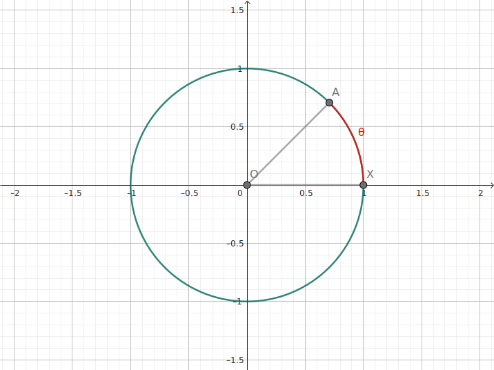
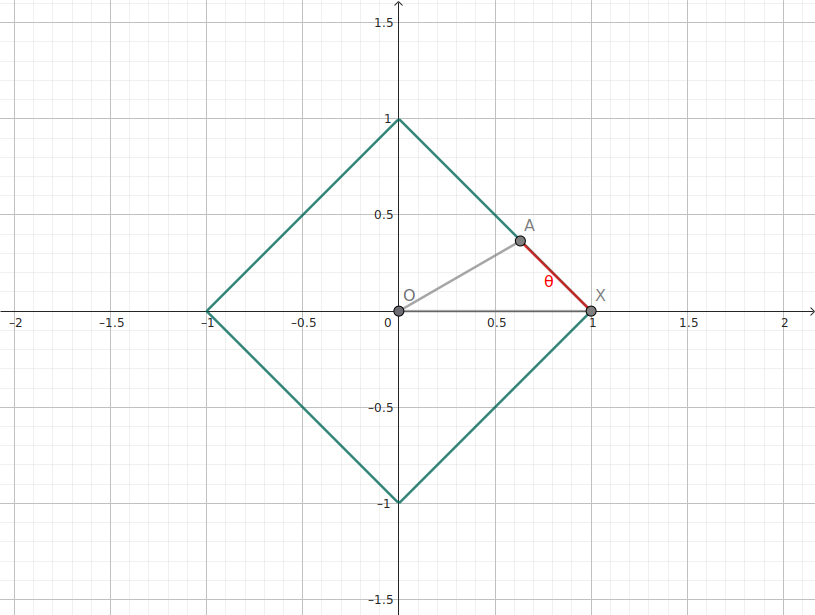
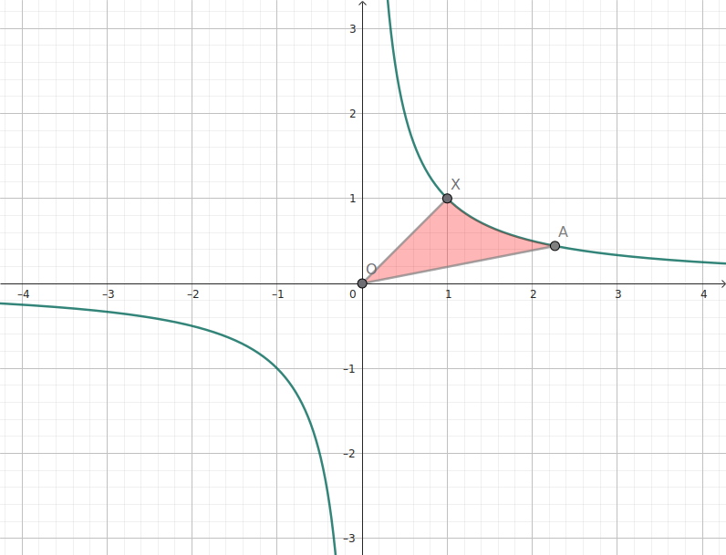
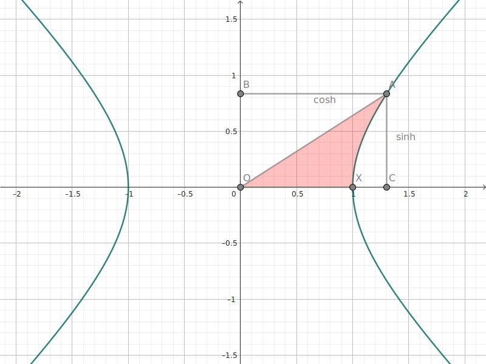

+++
title = '双曲角实在是太简单了'
published = 2025-10-16
description = '双曲角，双曲函数，Minkowski 空间'
image = 'cover.jpg'
tags = ['Analysis']
category = 'XITE'
draft = false
lang = ''
+++

# 双曲角实在是太简单了

我们在微积分学中见过自然对数 $\ln$ . 聪明的读者可能还见过 [双曲函数](https://zh.wikipedia.org/wiki/%E5%8F%8C%E6%9B%B2%E8%A7%92) $\sinh x = \frac{1}{2} (\exp x - \exp -x)$ , $\cosh x = \frac{1}{2} (\exp x + \exp -x)$ . 本文讨论 [双曲角](https://zh.wikipedia.org/wiki/%E5%8F%8C%E6%9B%B2%E8%A7%92) , 并利用这一概念互相联系地重新定义上述对象。为了简便，本文的讨论在平面上进行。

## 角

如果你接受过中国大陆的中学教育，你可能会有印象于这些角的描述：

- 平面内，一点引两条射线；

- 一条射线绕其端点旋转；

- 单位圆上一条圆弧的长度。

我们接下来将这些「传统意义上」的角称为 **圆角** 。在角的弧度制定义下这是名副其实的。一个角的大小被定义为单位圆的圆周角对应圆弧的长度（我们假装没有看见 $[0, 2\pi)$ 以外的角）。

在极坐标意义下，圆角还可以用来确定欧几里得空间中到选定点距离恒定的所有点的其中一个。或者说，圆角是圆上某一点的身份。

> [!NOTE]
> 
> 此处的表达不严谨。向量 $\mathbf u$ , $\mathbf v$ 的夹角 $\theta$ 是用空间中的内积诱导的。
> 
> $$
> \cos \theta = 
> \frac {\left< \mathbf u, \mathbf v \right>}
> {\lVert \mathbf u \rVert \cdot \lVert \mathbf v \rVert}
> $$
> 
> 其中范数定义为
> 
> $$
> \lVert \mathbf v \rVert = \sqrt { \left< \mathbf v, \mathbf v \right> }
> $$
> 
> 以上适用于实内积空间，对于 $\mathbb C$ 或者其他数域，角度的定义不一定一样方便。

在欧式几何中到定点距离恒定的点的集合是圆。这也是我们在定义圆角时选择使用了单位圆 $x^2 + y^2 = 1$ 的原因。

## 圆的推广

「圆」在通常的定义下使用的是 [欧几里得范数](https://zh.wikipedia.org/wiki/%E6%AC%A7%E5%87%A0%E9%87%8C%E5%BE%97%E8%B7%9D%E7%A6%BB) 。但是，我们研究的所有空间并不都是欧几里得空间。事实上，只要我们得到一个赋范向量空间，就可以类比地得到所谓的「圆」。例如，一个采用 $L_1$ 曼哈顿范数而非 $L_2$ 的「圆」。

进一步地，我们也可以用这个实则为正方形的「圆」上的「弧」，实则为周长上的折线段来定义「角」。通过这种朴素方法，我们在没有内积的情况下，也能够定义角度。这自然有局限性，例如角度不是线性的。

## 方法一：Minkowski 伪内积空间

虽然角度严格上是通过内积定义的，但事实上，我们不一定需要内积空间这样强的结构，就可以定义角度。这样能够得到双曲角的一种定义，通过 [Minkowski 伪内积](https://zh.wikipedia.org/wiki/%E9%96%94%E8%80%83%E6%96%AF%E5%9F%BA%E6%99%82%E7%A9%BA#%E6%95%B0%E5%AD%A6%E7%BB%93%E6%9E%84) 。

有 $\R^2$ 中的 Minkowski 伪内积定义（采用西海岸度规）

$$
\left< \mathbf u, \mathbf v \right>
= \mathbf u_0 \mathbf v_0 - \mathbf u_1 \mathbf v_1
$$

Minkowski 伪内积不满足正定性（即 $\left< \mathbf v, \mathbf v \right>$ 始终非负），因此不是标准的内积，但这没有太大影响。我们可以用类似的方式把它当作内积使用来推导角度的定义。

对于向量 $\mathbf u$ , $\mathbf v$ , 其夹角 $\theta$ 可以定义为

$$
\cosh \theta =
\frac{\left< \mathbf u, \mathbf v \right>}
{\sqrt{\left| \left< \mathbf u, \mathbf u \right> \right|
\cdot \left| \left< \mathbf v, \mathbf v \right> \right|}}
$$

这就是标准的双曲角的定义。我们使用双曲余弦而非余弦，是因为在 Minkowski 伪内积下，两个向量的内积 $\left< \mathbf u, \mathbf v \right>$ 可能比「范数」的乘积还要大。

我们不难发现上述定义下的「单位圆」其实是双曲线。这可以由方程

$$
\left< \mathbf v, \mathbf v \right> = 1
$$

展开内积的定义

$$
\mathbf v_0^2 - \mathbf v_1^2 = 1
$$

得到 $x^2 - y^2 = 1$ .

推广到任意 $n: \N$ , $\R^{1+n}$ 中，始终可以定义 Minkowski 伪内积

$$
\left< \mathbf u, \mathbf v \right>
= \mathbf u_0 \mathbf v_0
- \sum_{i = 1}^n \mathbf u_i \mathbf v_i
$$

从而继续得到双曲角。特别地，装配 Minkowski 伪内积的 $\R^{1+3}$ , 或者称为 [Minkowski 时空](https://zh.wikipedia.org/wiki/%E9%96%94%E8%80%83%E6%96%AF%E5%9F%BA%E6%99%82%E7%A9%BA) 被用于书写 [狭义相对论](https://zh.wikipedia.org/wiki/%E7%8B%AD%E4%B9%89%E7%9B%B8%E5%AF%B9%E8%AE%BA) 。

## 方法二：从「单位圆」出发

我们刚才通过赋予内积得到了「单位圆」为双曲线的结构。我们也可以反向操作，要求「单位圆」是双曲线来定义角。

我们采用直角双曲线 $xy = 1$ 作为单位圆，并且先考虑第一象限的情况。顺其自然地可以采用对称轴 $y = x$ 的方向作为角度 $0$ . 一个朴素的想法是采用 $(1, 1)$ 与 $(x, \frac{1}{x})$ 之间的双曲线弧长作为角度，但事实上由于双曲线上的弧长没有初等表达（ [椭圆积分](https://zh.wikipedia.org/wiki/%E6%A4%AD%E5%9C%86%E7%A7%AF%E5%88%86) ），我们选择了退而求其次地使用原点连线、双曲线与直线 $y = x$ 约束的 [双曲扇形](https://zh.wikipedia.org/wiki/%E9%9B%99%E6%9B%B2%E7%B7%9A%E6%89%87%E5%BD%A2) 的面积作为角度。人为规定向 $x$ 轴方向为正，$y$ 轴方向为负。显然这个双曲扇形的面积是单调的，「单位圆」双曲线上的点与双曲角一一对应。

注意到 $\frac{1}{x}$ 的积分发散。因此，双曲角可以在 $\R$ 上任意取值。

### 双曲对数

在推导上述定义的过程中，还存在一个简单的结论：点 $(x, \frac{1}{x})$ 的双曲角，或者标准双曲扇形的面积是 $\ln x$ . 聪明的读者可以利用 $\frac{1}{x}$ 的积分是 $\ln x$ , 以及双曲线 $xy = 1$ 下的矩形面积相等的性质容易地证明这一结论。

事实上，人们最早定义了函数 $\ln$ 来表达这个面积，并将其称为双曲对数。此后因为发现其是指数函数 $\exp$ 的反函数，而改成自然对数。

## 双曲函数

我们发现第一种定义下的「单位圆」是 $x^2 - y^2 = 1$ , 第二种是 $xy = 1$ , 并不相同。虽然这两者相似，在现代化的作法中，我们会直接采用 $x^2 - y^2 = 1$ 来定义双曲角。这将第二种的情景旋转 $45 \degree$ 即可。

这样做的一大好处是可以将双曲函数和双曲角的关系同三角函数和圆角的关系统一起来。因为我们知道 $(\cosh x)^2 - (\sinh x)^2 = 1$ 的形式和单位双曲线 $x^2 - y^2 = 1$ 相同，我们可以参数化单位双曲线为

$$
\begin{cases}
x = \cosh \theta \\
y = \sinh \theta
\end{cases}
$$

这就和圆角的正余弦和边长的关系完全一致。

需要注意的是，按照传统定义，点 $(\cosh \theta, \sinh \theta)$ 的双曲角是参数 $\theta$ 的一半而非 $\theta$ 本身。

$$
\begin{align*}
\int_0^\theta \frac{1}{2} (x \,\mathrm d y - y \,\mathrm d x) \\
& = \frac{1}{2} \int_0^\theta
\cosh \phi \,\mathrm d \sinh \phi - \sinh \phi \,\mathrm d \cosh \phi \\
& = \frac{1}{2} \int_0^\theta
(\cosh \phi)^2 \,\mathrm d \theta - (\sinh \phi)^2 \,\mathrm d \theta \\
& = \frac{1}{2} \int_0^\theta \,\mathrm d \theta \\
& = \frac{1}{2} \theta
\end{align*}
$$

这和单位圆上的结论是类似的，点 $(\cos \theta, \sin \theta)$ 对应扇形的面积是 $\frac{1}{2} \theta r^2 = \frac{1}{2} \theta$ . 为了避免这个麻烦，现代有时候直接将 $(\cosh \theta, \sinh \theta)$ 的参数 $\theta$ 定义为双曲角，而非双曲扇形的面积。
